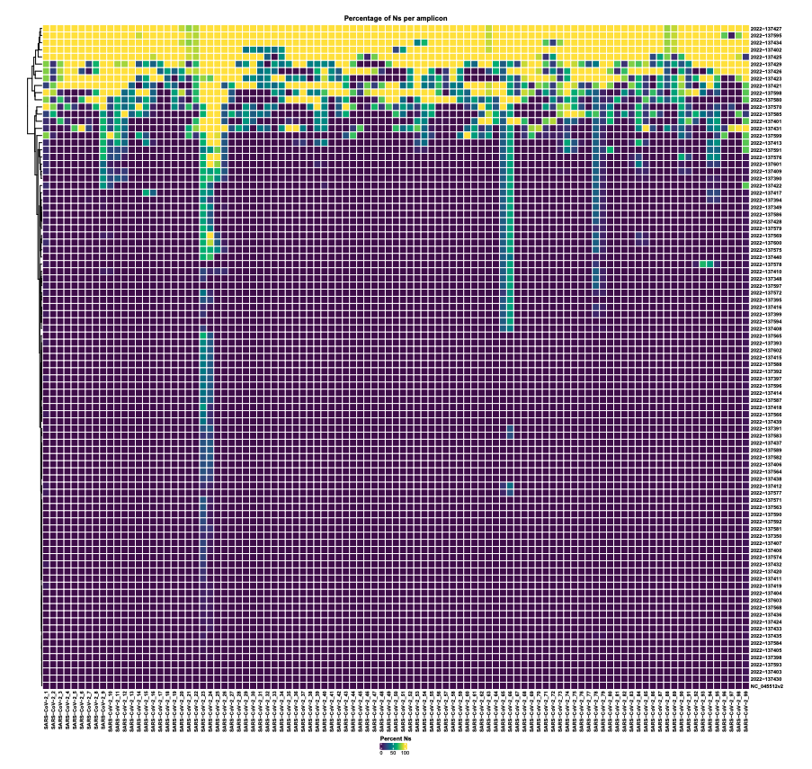

# covdrop 

Pipeline for detecting primer dropout in SARS-CoV-2 tiled amplicon genomes. 

## Install

### Github

```
git clone https://github.com/MDU-PHL/covdrop.git && cd covdrop
```

```
snakemake --use-conda -j -C fasta=samples.fa bed=artic_v4.1.bed
```

### [SNK](https://github.com/Wytamma/snk)

```
snk install MDU-PHL/covdrop
```

```
covdrop --fasta samples.fa --bed artic_v4.1.bed
```

## Heatmap 

[](docs/images/heatmap.pdf)

